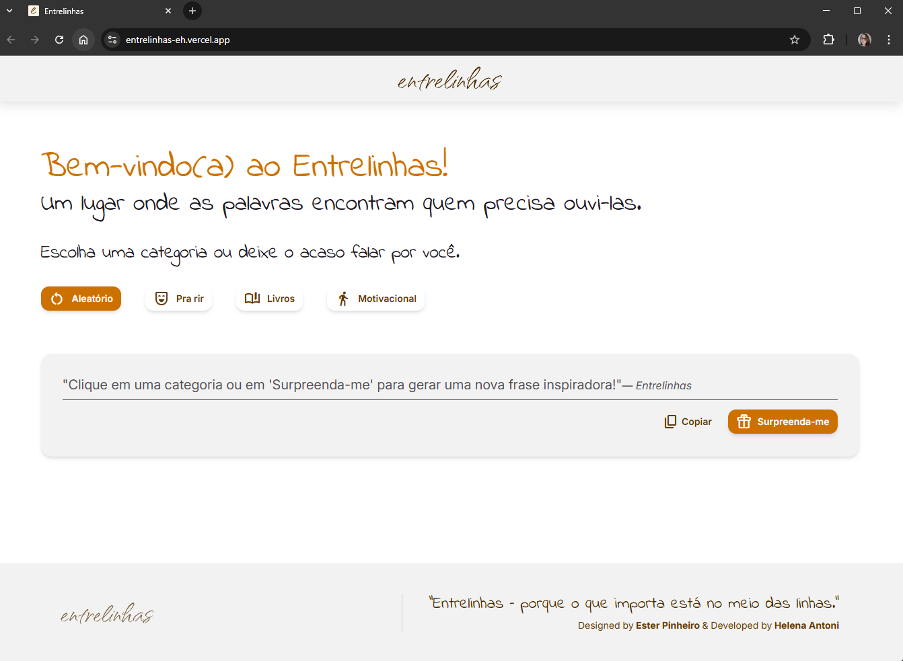

# Entrelinhas 

## 👩‍💻 Autoria
* **Desenvolvimento (Frontend & Backend):** [Helena Antoni](https://github.com/helena-antoni) 
  _(Clique para acessar o portfólio)_

* **Design (UI/UX):** [Ester Pinheiro](https://github.com/estercopinheiro)
  _(Clique para acessar o portfólio)_


## 📝 Descrição

Entrelinhas é um espaço digital feito para quem acredita no poder das palavras.
Um gerador de citações que vai além do aleatório — ele convida à pausa, à inspiração e ao encontro com pequenos pedaços de poesia cotidiana.
Entre uma linha e outra, um respiro criativo.

A aplicação utiliza a Inteligência Artificial do **Google Gemini** para geração dinâmica de citações inspiradoras, de humor e de sabedoria, garantindo segurança, performance e escalabilidade *serverless*. 


O projeto é uma colaboração: a interface e o design foram criados pela designer **Ester Pinheiro**, e o código e o backend (API Route) foram desenvolvidos por **Helena Antoni**.

## 🔶 Funcionalidades Principais:
* Geração de citações por temas (Aleatório, Humor, Livros e Motivacional).
* Saída forçada em formato JSON, garantindo consistência.
* Implementação de regras éticas e de originalidade via `systemInstruction` da IA.

## 🚀 Tecnologias Utilizadas
- **Next.js (React)**: Framework para construção da interface e criação das **API Routes Serverless**. 

- **TypeScript (TS)**: Garante tipagem estática, aumentando a robustez e prevenindo erros de tipagem no deploy. 

- **Google Gemini API**: Motor de Inteligência Artificial para geração de conteúdo e formatação de JSON. 

- **Vercel**: Plataforma de deploy contínuo, responsável por hospedar a aplicação e injetar as variáveis de ambiente com segurança. 

- **Tailwind CSS**: Framework CSS utility-first para um design rápido e responsivo.

- **Git & GitHub**: Controle de versão e hospedagem do repositório.

## ⚙️ Configuração Local e Execução

### Pré-requisitos e Setup
Para clonar e rodar este projeto na sua máquina (ambiente de desenvolvimento), siga os passos abaixo:

* **Pré-requisitos:** Você precisará ter o **Node.js** (versão 18+) instalado.
* **Chave de API:** Uma chave de API do Google Gemini é obrigatória para o *backend* funcionar.

### Clonar e Instalar Dependências
```bash
git clone https://github.com/helena-antoni/entrelinhas.git
cd entrelinhas
npm install
```


### Configurar Variáveis de Ambiente
Crie um arquivo chamado .env.local na raiz do projeto para carregar sua chave de API de forma segura: _.env.local_ (Este arquivo DEVE ser ignorado pelo Git)

 ```sh
GEMINI_API_KEY="SUA_CHAVE_GEMINI..."
 ```
### Rodar o Servidor de Desenvolvimento
```sh
npm run dev
```
O projeto estará acessível em ```http://localhost:3000```.


## 🎨 Design do Figma
O design inicial foi construído seguindo os padrões modernos de UI/UX, focando em simplicidade e na citação como elemento principal.

_Clique [Aqui](https://www.figma.com/design/j1tn7DWLnjf8GkgWTcDqx6/entrelinhas?node-id=18-8970&t=RbHlf7y9F06S4ajP-1)  ou na imagem para acessar o Figma._
<p align="center">
<a href="[https://www.figma.com/design/j1tn7DWLnjf8GkgWTcDqx6/entrelinhas?node-id=18-8970&t=RbHlf7y9F06S4ajP-1]" >
  </a>
</p>


## 🌟 Visualize o Projeto

Acesse a aplicação em produção e gere suas próprias citações!

_Clique [Aqui](https://entrelinhas-eh.vercel.app)  ou na imagem para acessar o site._
<p align="center">
<a href="https://entrelinhas-eh.vercel.app" >
  </a>
</p>


## 🤝 Contato e Conexão

Quer falar sobre o código, design ou simplesmente conectar? Estamos abertas a novas conexões, colaborações e desafios!
 
### Conecte-se com as Autoras:

| Colaboradora | GitHub | LinkedIn | Email |
| :--- | :--- | :--- | :--- |
| **Helena Antoni (Dev)** | [](https://github.com/helena-antoni) | [](https://www.linkedin.com/in/helena-antoni/) | [](mailto:helena.antoni.dev@gmail.com) |
| **Ester Pinheiro (Design)** | [](https://github.com/estercopinheiro) | [](https://www.linkedin.com/in/ester-pinheiro/) | [](mailto:ester.copinheiro@gmail.com) |